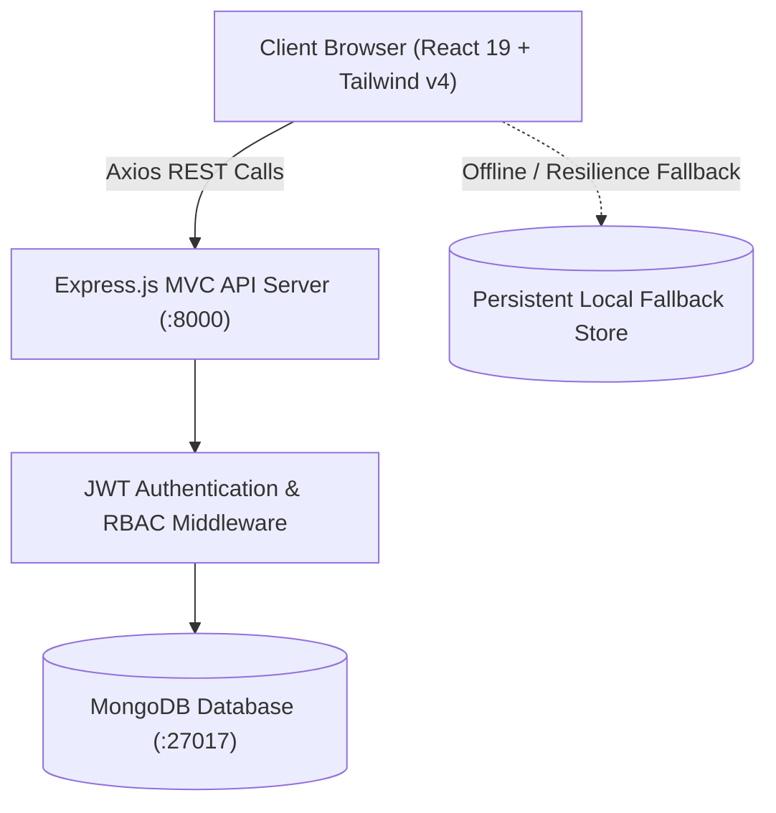

# 🏥 HealthForecast AI — St. Jude Medical Center

> **Enterprise Hospital Readmission Prediction, Patient Risk Stratification & Clinical Intelligence Platform**

[](https://react.dev/)
[](https://tailwindcss.com/)
[](https://nodejs.org/)
[](https://expressjs.com/)
[](https://www.mongodb.com/)
[](https://vitejs.dev/)
[](https://jwt.io/)

---

## 📖 Overview

**HealthForecast AI** is a full-stack MERN clinical operations and risk intelligence system developed for **St. Jude Medical Center**. The platform empowers healthcare clinicians, administrators, researchers, and system controllers with real-time biometric telemetry, automated 30-day readmission forecasting, clinical progress note writing, medication prescription management, and hospital-wide operational benchmarks.

---

## 🌟 Key Capabilities by Role

```
                     ┌────────────────────────────────────────────────────────┐
                     │          St. Jude Medical Center Gateway               │
                     └──────────────────────────┬─────────────────────────────┘
                                                │
                 ┌───────────────┬──────────────┴──────────────┬───────────────┐
                 ▼               ▼                             ▼               ▼
          🩺 Doctor Portal  🏦 Admin Portal             🧪 Research Lab  💻 SysAdmin Console
          • Patient Registry • Hospital KPIs            • Demographics   • Staff Directory
          • Risk Analysis    • Department Performance   • Cohort Trends  • RBAC Roles
          • Clinical Notes   • Capacity Index           • Anonymized DB  • Model Registry
          • Prescriptions    • CSV Spreadsheet Export   • Data Catalog   • Audit Log Stream
```

### 🩺 1. Doctor & Clinician Workspace (`/doctor/*`)
- **Interactive Risk Distribution**: Real-time visualization of patient cohorts categorizing high, medium, and low-risk readmission probabilities.
- **Patient Management Registry**: Live search, multi-criteria filtering (by Risk, Diagnosis, Doctor), multi-column sorting, and **Patient Registration**.
- **Clinical Action Tools**:
  - 📝 **Write Clinical Notes**: Categorized progress notes, physician consultations, and triage notes.
  - 💊 **Prescribe Medications**: Add medications and therapy regimens.
  - 💓 **Update Recovery Vitals**: Track blood pressure readings, recovery progress scores (0–100%), and medication adherence.
  - 🚪 **Status & Discharge Management**: Transition patients between *Stable*, *Improving*, *Critical*, or *Discharged*.
- **Clinical Decision Support Hub**: Interactive checklist to validate AI-recommended care protocols and discharge criteria.

### 🏦 2. Hospital Administrator Workspace (`/hospital-admin/*`)
- **Executive Dashboard**: Active inpatient count (1,420), bed occupancy management (81.3%), and readmission rate (14.2% vs 12.0% target).
- **Department Performance Benchmarks**: Recovery progress tracking across all 6 specialized hospital clinics.
- **Reporting & Export Engine**: Configurable query builder with automated **CSV spreadsheet export and browser download**.

### 🧪 3. Healthcare Researcher Workspace (`/researcher/*`)
- **HIPAA-Compliant Anonymization**: Automated PII sanitization across all research datasets.
- **Population Health Analytics**: Demographic age cluster distributions, stay duration analysis, and diagnosis correlations.
- **Longitudinal Trend Tracking**: Multi-month area charts tracking readmission benchmarks over time.
- **Research Datasets Repository**: Downloadable sanitized research cohorts with comprehensive data dictionaries.

### 💻 4. System Administrator Console (`/system-admin/*`)
- **Staff User Directory (CRUD)**: Create staff accounts, toggle active/inactive account status, reassign RBAC roles, and delete records.
- **Role Permission Matrix (RBAC)**: Fine-grained capabilities grid across all system roles.
- **AI Model Registry**: Machine learning telemetry, model weights, and simulated retraining triggers.
- **Live Security Audit Logs**: Searchable, timestamped audit trails capturing all logins and clinical write actions.
- **System Settings**: Configurable session timeouts, audit log retention rules, and complete system backup exports.

---

## 🎨 3D User Interface & Design Standards

- **Theme**: Crisp White (`#ffffff`, `bg-zinc-50`) with Crimson Red (`#dc2626`, `from-red-600 to-rose-700`) accents.
- **3D Components**:
  - **Mouse-Tracking 3D TiltCards**: React components that dynamically tilt on the X/Y axes in response to cursor position.
  - **3D Perspective Grid Floor**: Angled CSS 3D plane in the Hero section.
  - **Floating Stat Pills**: Continuous gentle float animations on key metrics.
  - **3D Rotating Logo Cube**: Perspective-transformed hospital crest.

---

## 🏗️ System Architecture



---

## 📁 Repository Structure

```
infosys/
├── backend/                        # Express.js MVC Backend
│   ├── config/                     # Database connection (db.js)
│   ├── controllers/                # Business logic (auth, patient, analytics, admin)
│   ├── middleware/                 # Auth, RBAC, error handling, audit logging
│   ├── models/                     # Mongoose schemas (User, Patient, Encounter, etc.)
│   ├── routes/                     # REST API route definitions
│   ├── utils/                      # Database seeder (seeder.js)
│   ├── .env.example                # Environment variables template
│   ├── package.json
│   └── server.js                   # Express server entry point
│
├── frontend/                       # React 19 + Vite + Tailwind CSS v4 Frontend
│   ├── public/                     # Static assets
│   ├── src/
│   │   ├── components/
│   │   │   ├── common/             # TiltCard, Modal, DashboardCard, Badges, etc.
│   │   │   └── layout/             # DashboardLayout (Sidebar, Navbar, Breadcrumbs)
│   │   ├── context/                # AuthContext (JWT session management)
│   │   ├── data/                   # Initial mock datasets
│   │   ├── pages/
│   │   │   ├── auth/               # LoginPage, ForgotPassword, NotFound, etc.
│   │   │   ├── doctor/             # DoctorDashboard, Patients, PatientDetails, etc.
│   │   │   ├── hospital-admin/     # AdminDashboard, OutcomeAnalytics, Reports, etc.
│   │   │   ├── researcher/         # ResearcherDashboard, PopulationHealth, etc.
│   │   │   ├── system-admin/       # SystemAdminDashboard, UserManagement, etc.
│   │   │   └── HomePage.jsx        # Public 3D Hospital Landing Page
│   │   ├── services/               # API service clients (auth, patient, analytics, admin)
│   │   ├── App.jsx                 # Route definitions & protected gateways
│   │   ├── index.css               # Tailwind v4 base styles & 3D keyframe animations
│   │   └── main.jsx                # React DOM entry point
│   ├── package.json
│   └── vite.config.js
│
├── .gitignore                      # Comprehensive Git exclusion rules
├── milestone.md                    # Detailed progress report & feature log
├── MILESTONE_1_REPORT.md           # Milestone submission report
└── README.md                       # Project documentation (this file)
```

---

## ⚙️ Installation & Quick Start

### 1. Prerequisites
- **Node.js** (v18.0.0 or higher)
- **MongoDB** (Local instance running at `mongodb://127.0.0.1:27017` or MongoDB Atlas URI)
- **npm** or **yarn**

---

### 2. Backend Setup

```bash
# Navigate to the backend directory
cd backend

# Install dependencies
npm install

# (Optional) Seed the database with initial users and patient records
npm run seed

# Start the backend server
npm run dev
```
> 🚀 Backend API will be running at: `http://localhost:8000`  
> 🔍 API Health check endpoint: `http://localhost:8000/api/v1/health`

---

### 3. Frontend Setup

```bash
# Navigate to the frontend directory
cd frontend

# Install dependencies
npm install

# Start the Vite development server
npm run dev
```
> 🌐 Frontend Application will be accessible at: `http://localhost:5173`

---

## 🔑 Default Test Credentials

| Role | Email | Password | Default Landing Page |
|---|---|---|---|
| 🩺 **Doctor / Clinician** | `doctor@healthforecast.ai` | `password123` | `/doctor/dashboard` |
| 🏦 **Hospital Administrator** | `admin@healthforecast.ai` | `password123` | `/hospital-admin/dashboard` |
| 🧪 **Healthcare Researcher** | `researcher@healthforecast.ai` | `password123` | `/researcher/dashboard` |
| 💻 **System Administrator** | `sysadmin@healthforecast.ai` | `prasad1234` | `/system-admin/dashboard` |

---

## 📡 REST API Reference

| Method | Endpoint | Description | Auth Required |
|---|---|---|---|
| `POST` | `/api/v1/auth/login` | Authenticate user & issue JWT token | No |
| `GET` | `/api/v1/auth/me` | Fetch currently authenticated user session | Yes |
| `GET` | `/api/v1/patients` | Retrieve patient list with search & filters | Yes (Doctor, Admin, SysAdmin) |
| `POST` | `/api/v1/patients` | Register new clinical patient record | Yes (Doctor, Admin, SysAdmin) |
| `GET` | `/api/v1/patients/:id` | Fetch complete patient clinical worksheet | Yes |
| `PUT` | `/api/v1/patients/:id` | Update patient record and vitals | Yes (Doctor, Admin, SysAdmin) |
| `POST` | `/api/v1/patients/:id/notes` | Add clinical progress note to patient | Yes (Doctor, Admin) |
| `POST` | `/api/v1/patients/:id/treatments` | Add medication / treatment to patient | Yes (Doctor) |
| `GET` | `/api/v1/analytics/hospital-dashboard` | Aggregate hospital KPIs & departmental metrics | Yes (Hospital Admin) |
| `GET` | `/api/v1/analytics/research-data` | Retrieve de-identified research cohorts | Yes (Researcher) |
| `GET` | `/api/v1/admin/dashboard` | Retrieve system telemetry and audit logs | Yes (System Admin) |
| `GET` | `/api/v1/admin/users` | List staff directory user accounts | Yes (System Admin) |
| `POST` | `/api/v1/admin/users` | Create new staff user account | Yes (System Admin) |
| `PUT` | `/api/v1/admin/users/:id/role` | Update user RBAC permissions | Yes (System Admin) |
| `PUT` | `/api/v1/admin/users/:id/toggle-status` | Toggle user active/inactive status | Yes (System Admin) |

---

## 📄 License & Attribution

Developed for **St. Jude Medical Center — HealthForecast AI**.  
Built with the MERN stack (MongoDB, Express.js, React 19, Node.js) and Tailwind CSS v4.

made for the internship project 
