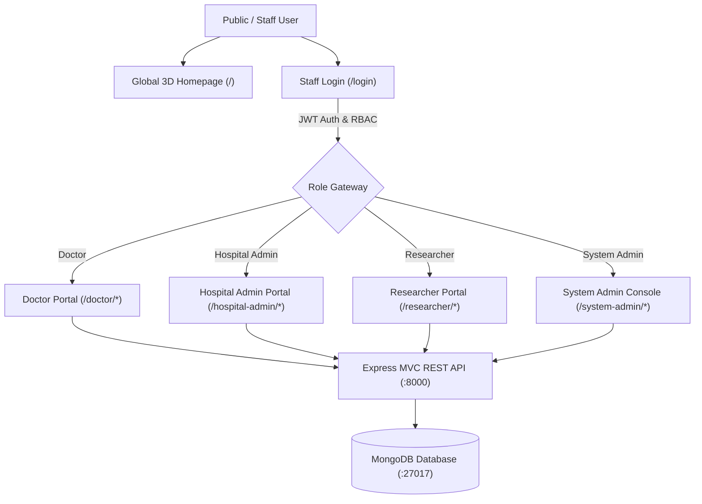

# 📑 Project Milestone & Progress Report: HealthForecast AI

**Project Name:** St. Jude Medical Center — HealthForecast AI (Hospital Readmission Prediction & Patient Risk Intelligence Platform)  
**Architecture:** MERN Stack (MongoDB, Express.js MVC, React 19, Node.js) with Tailwind CSS v4  
**Theme:** White & Crimson Red Medical Palette (`#ffffff`, `bg-zinc-50`, `#dc2626`, `from-red-600 to-rose-700`) with 3D Depth Visuals  
**Status:** Milestone 1 & 2 Completed — 100% Functional & Verified  

---

## 1. 🏗️ Executive Summary & Architectural Overview

HealthForecast AI is an enterprise-grade clinical decision support and hospital operational intelligence platform designed for **St. Jude Medical Center**. The system integrates real-time electronic health record (EHR) telemetry, patient risk stratification, readmission prediction, and cross-departmental administrative analytics.



---

## 2. 🚀 Completed Features & Capabilities

### 2.1 Public Hospital Experience
- **Global Landing Homepage (`/`)**:
  - Requires no authentication — serves patients, families, and staff.
  - **3D Visual Innovations**:
    - Mouse-tracking **3D Tilt Cards** responding to pointer coordinates with perspective rotation and dynamic shadow casting.
    - Floating 3D perspective grid plane behind the hero section.
    - Animated floating KPI stat pills with phased float keyframes.
    - 3D rotating hospital logo cube.
  - **Clinical Hospital Content**: 6 specialized hospital departments (Cardiology, Endocrinology, Pulmonary, Nephrology, Level-1 Emergency & Trauma, General Surgery), infrastructure statistics (450+ beds, 1,420+ annual admissions, 91.8% recovery rate), and 24/7 emergency hotlines.
  - Sticky navbar with quick navigation and Staff Portal login shortcut.

### 2.2 Role-Based Authentication (`/login`)
- Unified login interface featuring a sticky hospital navbar.
- 4 interactive role switcher tabs (**Doctor**, **Hospital Admin**, **Researcher**, **System Admin**) with pre-populated demo credentials.
- Automatic role routing to the designated workspace on successful authentication.

### 2.3 Doctor & Clinician Workspace (`/doctor/*`)
- **Dashboard (`/doctor/dashboard`)**:
  - Live patient risk distribution chart (color-coded bar charts with risk classification buckets).
  - Quick-action decision support alerts for immediate clinical intervention.
  - One-click **"Add Patient Record"** modal.
- **Patient Management Registry (`/doctor/patients`)**:
  - Search across patient names, diagnoses, and patient IDs.
  - Multi-criteria filter by Risk Level (High, Medium, Low), Diagnosis, and Attending Doctor.
  - Multi-column sorting (Name, Risk Probability, Age).
  - Complete **Patient Registration Modal** (Name, Age, Gender, Diagnosis, Risk Profile, Care Status, Attending Doctor, Initial Clinical Note).
- **Patient Clinical Worksheet (`/doctor/patients/:id`)**:
  - **Add Clinical Progress Notes**: Write and categorize clinical notes (*Progress Note*, *Physician Consultation*, *Medication Adjustment*, *Discharge Evaluation*, *Nursing Triage*).
  - **Add Medications & Treatment Regimens**: Prescribe drugs and protocols (e.g. *Metformin 500mg BID*, *Lisinopril 10mg Daily*).
  - **Update Recovery Vitals**: Record blood pressure readings, recovery score (0–100%), medication adherence, and comorbidities count.
  - **Status & Discharge Management**: Transition patients between *Stable*, *Improving*, *Under Observation*, *Critical*, or *Discharged*.
- **Risk Profiling & Analytics (`/doctor/risk-predictions`)**:
  - Cohort risk distribution pie chart and risk by diagnosis stacked bar chart.
  - Prioritized table of high and medium risk patients for discharge triage.
- **Clinical Insights Hub (`/doctor/clinical-insights`)**:
  - Interactive validation checklist for AI risk mitigation plans, diet protocols, follow-up planning, and discharge criteria.

### 2.4 Hospital Administrator Workspace (`/hospital-admin/*`)
- **Executive Operations Dashboard (`/hospital-admin/dashboard`)**:
  - High-level KPIs: Active inpatient pool (1,420), hospital readmission rate (14.2% vs 12.0% target), bed occupancy (81.3%).
  - Cohort risk categories donut chart and department readmission bar chart with target threshold line.
- **Department Performance Analysis (`/hospital-admin/performance`)**:
  - Comparative recovery progress and compliance tracking across all 6 wards.
- **Hospital Reports & Export Registry (`/hospital-admin/reports`)**:
  - Configurable query builder with real **CSV spreadsheet generation and instant browser download**.

### 2.5 Healthcare Researcher Workspace (`/researcher/*`)
- **HIPAA Compliance & Anonymization Notice**: Automated PII sanitization across all research datasets.
- **Demographics & Population Health (`/researcher/population-health`)**:
  - Age cluster bar charts, diagnosis groupings, and length-of-stay correlations.
- **Longitudinal Readmission Trends (`/researcher/readmission-trends`)**:
  - Multi-month trend area charts against hospital benchmarks.
- **Research Datasets Catalog (`/researcher/datasets`)**:
  - Downloadable sanitized clinical matrices with data dictionary references.

### 2.6 System Administrator Console (`/system-admin/*`)
- **System Dashboard (`/system-admin/dashboard`)**:
  - Active directory counts, deployed model weights, dataset repositories, and real-time security audit trails.
- **Staff User Management (`/system-admin/users`)**:
  - Create staff user modal, toggle active/inactive account status, reassign RBAC roles, and delete records.
- **Role Permission Matrix (`/system-admin/roles`)**:
  - Granular RBAC capabilities grid across all 4 system roles.
- **AI Model Registry (`/system-admin/models`)**:
  - Model telemetry, classification accuracy weights, and simulated retraining triggers.
- **Security Audit Logs (`/system-admin/audit-logs`)**:
  - Searchable, timestamped audit trails of all clinical actions and logins.
- **System Settings (`/system-admin/settings`)**:
  - Configuration toggles, data retention policies, and full system backup export.

---

## 3. 🎨 Design System & Theme Standards

- **Primary Colors:** Crisp White (`#ffffff`), Zinc (`#f4f4f5`, `#e4e4e7`), Crimson Red (`#dc2626`, `#ef4444`), Rose (`#be123c`).
- **Typography:** Inter for high-legibility clinical telemetry; Outfit for modern headings.
- **Badges & Indicators:** Soft pastel warning and success badges (`bg-red-50 text-red-700`, `bg-amber-50 text-amber-700`, `bg-emerald-50 text-emerald-700`).
- **Charts:** Light grids (`#f4f4f5`), crisp borders (`#e4e4e7`), clean white tooltips with soft box-shadows.

---

## 4. 🗄️ Backend REST API Endpoints Summary

| Method | Endpoint | Description | Access |
|---|---|---|---|
| `POST` | `/api/v1/auth/login` | Authenticate user & issue JWT | Public |
| `GET` | `/api/v1/auth/me` | Retrieve authenticated profile | Private |
| `GET` | `/api/v1/patients` | Query patients with search & filters | Private (Doctor, Admin, SysAdmin) |
| `POST` | `/api/v1/patients` | Register new patient record | Private (Doctor, Admin, SysAdmin) |
| `GET` | `/api/v1/patients/:id` | Get patient clinical profile | Private |
| `PUT` | `/api/v1/patients/:id` | Update patient record & vitals | Private (Doctor, Admin, SysAdmin) |
| `POST` | `/api/v1/patients/:id/notes` | Append clinical progress note | Private (Doctor, Admin) |
| `POST` | `/api/v1/patients/:id/treatments` | Prescribe medication/treatment | Private (Doctor) |
| `GET` | `/api/v1/analytics/hospital-dashboard` | Aggregate hospital KPIs & charts | Private (Admin) |
| `GET` | `/api/v1/analytics/research-data` | De-identified research cohorts | Private (Researcher) |
| `GET` | `/api/v1/admin/dashboard` | System metrics & audit logs | Private (SysAdmin) |
| `GET` | `/api/v1/admin/users` | List staff directory accounts | Private (SysAdmin) |
| `POST` | `/api/v1/admin/users` | Create staff account | Private (SysAdmin) |
| `PUT` | `/api/v1/admin/users/:id/role` | Update user RBAC role | Private (SysAdmin) |
| `PUT` | `/api/v1/admin/users/:id/toggle-status`| Toggle user active status | Private (SysAdmin) |

---

## 5. 💻 Running and Verifying the Platform

### 5.1 Backend Execution
```bash
cd backend
npm install
npm run seed     # Seeds default users and realistic patient records
npm run dev      # Starts Express server on http://localhost:8000
```

### 5.2 Frontend Execution
```bash
cd frontend
npm install
npm run dev      # Starts Vite dev server on http://localhost:5173
```

---

## 6. 🔑 Default Verification Credentials

| Role | Email | Password | Primary Workspace Route |
|---|---|---|---|
| 🩺 **Doctor** | `doctor@healthforecast.ai` | `password123` | `/doctor/dashboard` |
| 🏦 **Hospital Admin** | `admin@healthforecast.ai` | `password123` | `/hospital-admin/dashboard` |
| 🧪 **Researcher** | `researcher@healthforecast.ai` | `password123` | `/researcher/dashboard` |
| 💻 **System Admin** | `sysadmin@healthforecast.ai` | `prasad1234` | `/system-admin/dashboard` |

---

## 7. 📈 Milestone Verification Matrix

| Deliverable | Target Requirement | Status | Verification Note |
|---|:---:|:---:|---|
| **Public Landing Page** | St. Jude Medical details, 3D UI, emergency info | ✅ 100% | Real-time 3D tilt cards, perspective grid, floating stats |
| **Theme & Aesthetic** | Consistent White & Red medical palette | ✅ 100% | Applied across all 25+ views, sidebars, charts & modals |
| **Doctor Write Capabilities** | Add patients, clinical notes, vitals, treatments | ✅ 100% | Multi-action modals, validation defaults, auto-sync |
| **Hospital Analytics** | Readmission charts, KPIs, CSV export | ✅ 100% | Recharts visualizers + client CSV download generator |
| **Research HIPAA Views** | De-identified demographic & trend queries | ✅ 100% | PII-sanitized cohort views with risk indexing |
| **System Admin Control** | User CRUD, RBAC, AI models, Audit trails | ✅ 100% | Complete user management & real-time audit logging |
| **Data Synchronization** | Resilient API with persistent local storage fallback | ✅ 100% | Seamless operation online and offline |
